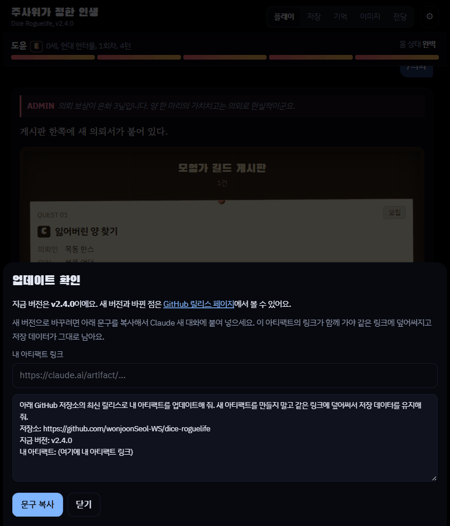
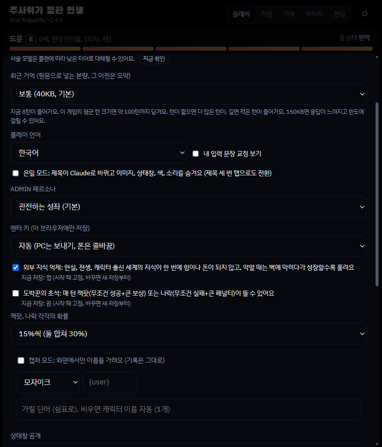
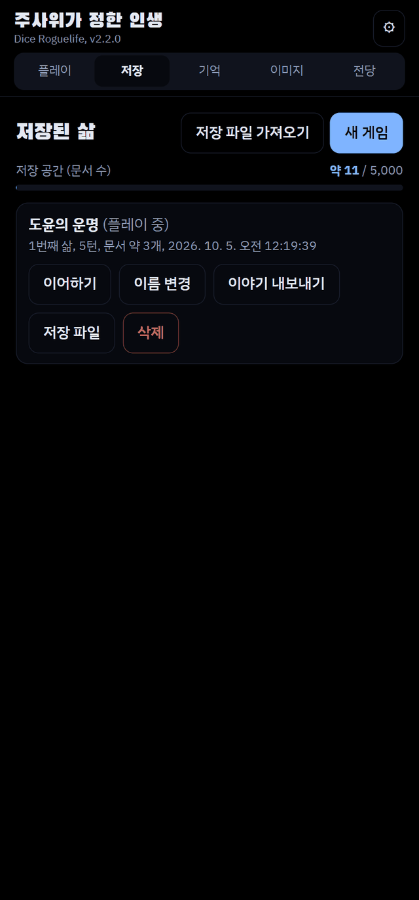
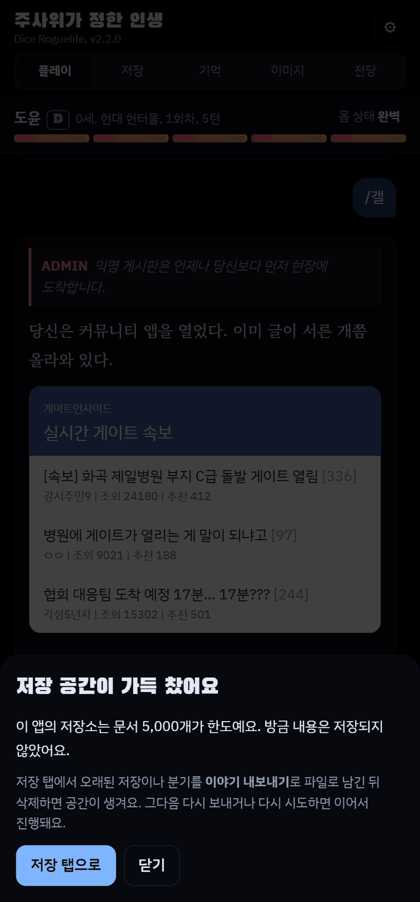

# 주사위가 정한 인생 (Dice Roguelife) - 로그라이크 AI 채팅 게임

세계, 종족, 신분, 재능을 주사위가 정하고, Claude가 웹소설 문체로 그 삶을 서술하는 한국어 텍스트 로그라이크입니다.
플레이어는 대사와 행동을 입력하고, 결과가 갈리는 순간에는 d100 판정이 굴러갑니다. 죽으면 회귀해서 다른 세계의 다른
몸으로 다시 태어나고, 지난 삶에서 하나를 물려받습니다.

- 헌터물, 무협, 로판, 아포칼립스, 탑 등반 등 장르별 세계와 등급(EX부터 F까지)
- 판정 주사위, 대성공과 대실패, 생활 운, 도박꾼의 초석 같은 운 요소
- 뉴스, 의뢰 게시판, 커뮤니티, 메신저 위젯과 `/명령어`
- 다시 쓰기, 분기, 판정 질문(이의 제기)과 정정
- 캐릭터 초상화와 배경을 직접 올려 장면에 붙이는 이미지 라이브러리
- 인생 결산과 전당, 이야기 내보내기(Markdown, HTML), 저장 파일 내보내기와 가져오기

## 설치 (비개발자용)

1. [claude.ai](https://claude.ai)에서 새 대화를 열어요.
2. 아래 문구를 **그대로 복사해서 붙여넣어요.**

```
아래 링크의 최신 버전 dice-roguelife.html 파일을 받아서, 내 아티팩트로 게시해 줘.
db, sample, user, assets, downloads 기능이 모두 필요해.
https://github.com/wonjoonSeol-WS/dice-roguelife/releases/latest/download/dice-roguelife.html
```

3. Claude가 만들어 준 링크를 **즐겨찾기에 저장**하고, 그 링크에서 플레이해요.

- 링크를 받을 수 없다고 하면 [Releases](https://github.com/wonjoonSeol-WS/dice-roguelife/releases/latest)에서 `dice-roguelife.html`을 내려받아 대화에 첨부하고 같은 문구를 보내요.
- 저장은 그 링크에 묶여요. 나중에 새 버전으로 바꿀 때도 **새 아티팩트를 만들지 말고 같은 링크에 덮어써요.** 방법은 아래 [업데이트 방법](#업데이트-방법)이에요.
- 화면과 사용법은 [가이드 사이트](https://wonjoonseol-ws.github.io/dice-roguelife/)에서 볼 수 있어요.

## 실행 환경

**claude.ai 아티팩트 전용입니다.** 일반 웹사이트로 열면 Claude를 호출할 수 없어서 게임이 시작되지 않습니다. 페이지는
아티팩트가 제공하는 다음 기능을 씁니다.

| 기능 | 쓰는 곳 |
| --- | --- |
| `db` | 저장, 설정, 전당, 이미지 목록 (아티팩트마다 따로 있는 데이터베이스) |
| `sample` | 서술(Claude 호출) |
| `user` | 플레이어별 저장 공간 구분 |
| `assets` | 초상화와 배경 이미지 파일 |
| `downloads` | 이야기와 저장 파일 내보내기 |

**이미지 에셋은 저장소에 들어 있지 않습니다.** 이미지 없이도 텍스트로 플레이할 수 있고, 초상화와 배경은 게임 안의
이미지 탭에서 아티팩트마다 직접 올립니다. 파일 이름이 `female3_smile.png`(세트_표정)나 `bg_tavern_night.png` 꼴이면
종류와 세트를 알아서 분류합니다.

## 내 아티팩트로 띄우기 (직접 빌드하는 개발자용)

1. 페이지를 빌드합니다. Node.js가 필요합니다(아래 "개발").
   ```
   npm ci
   npm run build
   ```
   결과는 `dist/dice-roguelife.html` 한 파일입니다.
2. claude.ai 대화에 이 파일을 올리고, 아티팩트로 게시해 달라고 요청합니다. 위 표의 기능(`db`, `sample`, `user`,
   `assets`, `downloads`)이 필요하다고 함께 알려 주세요.
3. 게시된 링크에서 플레이합니다. **저장 데이터는 그 아티팩트에 묶여 있습니다.** 나중에 새 버전으로 바꿀 때도 새
   아티팩트를 만들지 말고 같은 링크에 덮어써야 저장이 유지됩니다. 게임 안의 ⚙ 설정에서 "업데이트 확인"을 누르면 그대로
   붙여 넣을 수 있는 요청 문구가 나옵니다.

서술 프롬프트는 빌드할 때 `prompts.json`에서 페이지 안에 들어갑니다. 아티팩트 데이터베이스의 `config/prompt` 문서가
있으면 그 값이 항목별로 우선합니다(자세한 내용은 [RELEASING.md](RELEASING.md)).

## 업데이트 방법

- 새 아티팩트 만들지 말 것. **같은 링크에 덮어써야** 저장 유지
- 순서
  - ⚙ 설정 → **업데이트 확인**
  - 내 아티팩트 링크 붙여넣기
  - **문구 복사** → Claude 새 대화에 붙여넣기
  - Claude가 같은 링크에 덮어씀
- 불안하면 먼저 저장 탭에서 저장 파일 내보내기



## 비용: 크랙형 챗 서비스와 비교

- 크랙: 호출 단위 과금. 이 게임: Claude 구독(정액)
- 가정: 크랙 $20 요금제 Sonnet 한 호출 61원, 환율 1,400원/$

| 한 달 호출 수 | 크랙 (61원/호출) | 이 게임 (Claude $20 ≈ 28,000원) |
| ---: | ---: | ---: |
| 100 | 6,100원 | 28,000원 |
| 300 | 18,300원 | 28,000원 |
| **약 460 (하루 15회)** | **28,060원** | **28,000원** |
| 600 | 36,600원 | 28,000원 |
| 1,000 | 61,000원 | 28,000원 |
| 1,500 | 91,500원 | 28,000원 |

- 월 약 460호출 초과 → 이 게임이 저렴
- 이미 Claude 구독 중 → 추가 비용 0원
- 구독은 사용량 한도 있음 (무제한 아님, 한도는 Anthropic이 정함)

### 컨텍스트와 이득

- 호출당 정액: 얼마를 보내도 값 동일 → 서비스는 적게 보낼수록 이득 → 기억이 잘림
- 이 게임: 최근 대화 분량을 사용자가 설정 (⚙ 설정, 기본 40,000바이트, 10,000~200,000)
- 꽉 채울수록 이야기 기억이 좋아짐
- 단, 많이 보낼수록 구독 사용량도 빨리 소모 → 한도에 자주 걸리면 줄일 것



## 설계 결정: 왜 아티팩트로 배포하는가

**목표:** 비개발자가 서버, API 키, 결제 설정 없이 앱을 배포하고 **본인 계정으로 바로 쓰기**

### 결정

- claude.ai 아티팩트 하나로 배포
- 호출(`sample`), 저장(`db`), 파일(`assets`), 사용자(`user`)는 아티팩트 런타임이 제공
- 비용은 **사용자 본인의 Claude 구독**에서 차감

### 대안 비교

| 대안 | 탈락 이유 |
| --- | --- |
| API 키 방식 | 키 발급과 입력이 필요, 호출당 과금이라 비용 예측 어려움 |
| 운영자 서버 | 서버와 DB 운영 필요, 모든 사용자의 호출 비용을 운영자가 부담 |
| **아티팩트 (선택)** | 서버, 키, 결제 설정 없음. 운영 비용 0원 |

### 얻은 것

- 설치와 설정 없음, 링크만 열면 시작
- 운영 비용 없음 → 오래 유지 가능
- 정액이라 요금 예측 가능

### 감수한 것 (trade-off)

| 감수한 것 | 대처 |
| --- | --- |
| **저장 용량 제한** (오래 플레이한 저장이 쌓이면 가득 참) | 가득 차면 저장 안 됨 → 저장 탭에서 오래된 저장을 **내보낸 뒤 삭제** |
| **안전 필터가 API보다 엄격** | 탈옥 같은 경험 불가. **성인 콘텐츠는 여전히 크랙 사용** |
| 저장이 아티팩트에 묶임 | 업데이트는 항상 같은 링크에 덮어쓰기 |
| 이미지가 아티팩트마다 따로 | 이미지 탭에서 다시 올리기, 또는 `팩 내보내기` |
| 사용량 한도를 Anthropic이 정함 | 직접 못 바꿈 → 최근 대화 분량을 줄여 완화 |
| 한 호스트에 의존 | 아래 확장성 참고 |




### 확장성

- 호스트 접근은 `src/js/host.js` 어댑터 한 곳으로 격리
- 지금은 **Claude만 지원**
- 어댑터 추가 시 Gemini 등 다른 호스트 가능
- GPT: 아티팩트 같은 기능이 없어 지원 계획 없음

## 개발

필요한 것: Node.js 20.19 이상(또는 22.13 이상). 개발 도구는 모두 `package.json`에 고정된 npm 패키지입니다.

```
npm ci                             # esbuild, ESLint, Prettier, Playwright (고정 버전)
npx playwright install chromium    # 테스트용 브라우저, 처음 한 번

npm run build      # src/ → dist/dice-roguelife.html
npm run lint       # 문법, ESLint, Prettier 형식, 주석에 삼켜진 코드 검사
npm run format     # Prettier로 정렬
npm test           # Playwright 테스트 전체 (3개 병렬)
npm run release -- 2.2.0   # 버전 올리기, 검사, 테스트, 패키지
```

- 소스는 `src/`에 있습니다. `src/js/`의 파일은 ES 모듈이고, 빌드가 esbuild로 `main.js`부터 묶어 페이지에 넣습니다.
- 아티팩트 런타임(`window.claude`)은 호스트 어댑터 `src/js/host-claude.js`만 씁니다. 다른 호스트를 붙이려면 `host.js`의
  계약대로 어댑터를 하나 더 만들면 됩니다.
- 버전은 `package.json`의 `version` 한 곳에만 있습니다.
- 테스트 하나만 돌릴 땐 `npx playwright test smoke`, 브라우저를 띄워 보려면 `--headed`, 실패한 테스트를 단계별로 보려면
  `npx playwright show-trace`나 `--ui`를 씁니다.
- 구조와 턴 흐름, 저장 형식은 [ARCHITECTURE.md](ARCHITECTURE.md), 배포 절차는 [RELEASING.md](RELEASING.md)를
  보세요.

## 라이선스

[MIT](LICENSE)
